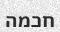

# 📜 OCR & Diacritization Project By Tsuriel Vizel And Avraham Guez

Welcome to the **OCR & Diacritization** project! 🎯 
This repository contains all the data, scripts, and trained models used to build and run two separate AI models:  
1. **OCR Model** – to recognize text from images.  
2. **Diacritization Model** – to add *nikkud* (vowel marks) to Hebrew text.  

Below you’ll find a full breakdown of the repository structure and the purpose of each folder and file.  

---

## 📂 Project Structure

### 1. **DiacData** 📚  
Contains all the **text data** used to train the *Diacritization Model*.  
- Includes text **with nikkud** ✅ and **without nikkud** ❌.  
- The model learns from these pairs to predict missing vowel marks on plain Hebrew text.  
- **Main purpose:** Provide training data for the `DiacModel.py` script.

---

### 2. **OcrData** 🖼️  
Stores the **training and testing data** for the OCR model.  

- Contains **images of Hebrew text** 📄 and their corresponding label files.  
- These datasets are used by `OcrModel.py` to train the OCR model to recognize **printed or handwritten Hebrew text**.  

🛠 **How we built the dataset:**  
We created our own **custom “home-made” dataset** from Hebrew books.  
1. We downloaded Hebrew texts in `.txt` format from **[sefaria.org](https://www.sefaria.org.il/texts)**.  
2. Using the Python library **[trdg](https://github.com/Belval/TextRecognitionDataGenerator)** (*Text Recognition Data Generator*), we transformed these raw text files into a large collection of synthetic training images.  
3. This process allowed us to create a dataset of **~10,000 samples** 📦.  

📌 **Command used to generate the dataset**:  
```bash
trdg -i hebrew_1.txt -fd fonts/ -c 10000 -l he -w 1 --output_dir output1/
```
Where:

-i hebrew_1.txt → Input Hebrew text file.

-fd fonts/ → Folder containing Hebrew fonts.

-c 10000 → Number of images to generate.

-l he → Language code for Hebrew.

-w 1 → Words per image (1 in this case).

--output_dir output1/ → Output folder for generated images.

✨ This gave us full control over the dataset, including the font styles, image size, and number of samples, making our OCR model more robust and accurate.

---

### 3. **Models** 🏆 
This is where the **trained models** are stored after training is complete.  
- Each model is saved in a format ready to be loaded for inference.  
- **Contents:**  
  - `OcrModel` (final OCR model)  
  - `DiacModel` (final diacritization model)  

---

### 4. **UseModels** 🚀  
Contains Python scripts to **use the trained models** for real-world tasks.  
- Scripts to load and run **only the OCR model** 🖋️  
- Scripts to load and run **only the Diacritization model** ✨  
- Scripts to **chain both models** so you can:
  1. Recognize text from an image (OCR).
  2. Automatically add vowel marks (Diacritization).  

This folder is your **go-to** when you want to *use* the models rather than train them.

---

### 5. **tools** 🛠️  
A collection of **utility scripts** used throughout the project.  
- Functions for data preprocessing.  
- Helper scripts for training, evaluation, and formatting datasets.  
- Custom Python tools to simplify repetitive tasks.

---

## 🐍 Main Python Scripts

### **`OcrModel.py`** 📄  
- Script to train the **OCR model**.  
- Loads `OcrData` dataset, preprocesses it, trains the model, and saves it into `Models`.  

### **`Diacmodel.py`** ✒️  
- Script to train the **Diacritization model**.  
- Uses `DiacData` (text pairs) to learn how to insert nikkud into plain Hebrew text.  
- Saves the trained model into `Models`.  

---

## 🔄 Typical Workflow

1. **Prepare Data**  
   - Place OCR training images inside `OcrData`.  
   - Place diacritization text data inside `DiacData`.  

2. **Train Models**  
   - Run `OcrModel.py` → generates OCR model.  
   - Run `Diacmodel.py` → generates diacritization model.  

3. **Use Models**  
   - Go to `UseModels` and run the script for the task you need (OCR only, Diacritization only, or both combined).  

---

## 💡 Usage
```bash

# Run OCR on an image
python UseModels/use_ocr.py //just need to change the path to the picture in the script

# Add diacritics to text
python UseModels/use_diac.py "שלום עולם"

# Full pipeline: OCR + Diacritics
python UseModels/usemodels.py 
```
---

## Concrete Example
| Step | Input / Output | Description |
|------|---------------|-------------|
| 🖼️ Input Image |  | A Hebrew word image with no diacritics. |
| ✍️ OCR Output | חכמה | The OCR model recognizes the text without nikkud. |
| 🎯 Final Output | חָכְמָה | The diacritization model adds the correct vowel marks. |

---

📌 The beauty of this pipeline is that **each model can be used independently** or **together** depending on your needs.

---

**Thank you for reading us.**

***Tsuriel and Avraham.***

